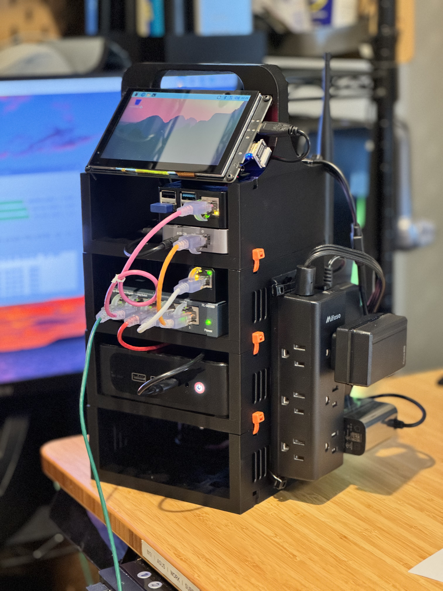

# MiniStackableRack
Easy to make, deploy and remotely manage Home Automation/Monitoring/Server flexible solution.

## What does it do?

	• Provides an easy to make, deploy and remotely manage Home Automation/Monitoring/Server flexible solution.
		○ "easy to make"
			§ 3D Printable in Bambu Lab's A1 Mini (18x18x18 cm print-bed area)
			§ Racks stack up with zip ties. Stack as many as you need. Quick, robust,  virtually no assembly.
			§ Readily available components.
		○ "easy to … deploy":
			§ Prepare locally and ship to deploy. Requires 1 Cable for Power (110V/220V), 1 Cable for Data (ETH RJ45 or none with Wi-Fi fallback). Once connected, all can be done remotely.
		○ "easy to … remotely manage"
			§ Remote KVM enables complete remote management of MiniPC (inc. OS imaging).
			§ Tailscale provides straight forward individual remote access to each component without any port-forwarding / complex network setup.
		○ "flexible": 
			§ Proxmox will enable you to deploy anything.
			§ Scalable, stack as many racks as mecessary.

## Why is it useful?

	• Solution: Deploy at a relative's home, 2nd house, and you have yourself:
		○ a VPN at another country, 
		○ a redundant backup location, or upload a new movie for your family on the remote Plex server running on Proxmox,
		○ an ability to see all devices in each deployed network with Tailscale Subnets (e.g.: print something for your dad at his place), 
		○ an ability to deploy, maintain and integrate multiple Home Assistant instances into one overview/dashboard. Sensors, cameras, power monitoring, etc.
	• Smaller form factor: As wide and deep as the largest component, the MiniPC/NUC. I love the 10 inch Mini Rack (don't get me wrong, all hail), but sometimes it feels unnecessarily wide and deep.
	• This Git Page: 
		○ Food-for-thought for you hopefully.
		○ E2E solution.

## Who maintains:

	• Me ( eduardocenci.com / youtube.com/boredengineer )
		○ Self interest in building documentation to facilitate increase in maturity and manufacturability of more units.

## .gitignore

	• Credentials (omit)
	• All content under folder gitignore

## Git Folder Structure

	• Root
		○ gitignore
		○ 3d-models-printjobpackages
		○ scripts
			
		

## Access/Links (deployed system) | Credentials
	
| Deployment | Device            | Access/Links (deployed system)     | Credentials |
|------------|-------------------|------------------------------------|-------------|
| Bnu        | Bnu-proxmox       | https://bnu-proxmox:8006/          | [redacted]  |
| Bnu        | Bnu-homeassistant | http://bnu-homeassistant:8123/     | [redacted]  |
| Bnu        | Bnu-glkvm         | https://bnu-glkvm/                 | [redacted]  |
| Bnu        | Bnu-raspberrypi   | RealVNC or SSH                     | [redacted]  |

## Topology

	• Home Automation/Monitoring/Server MiniStackableRack. Easy to deploy and remotely manage multiple instances.
		○ Input: One Cable for 110V / 220 V Power, One Cable for 1GB Ethernet Cable
		○ MiniPC running Proxmox (Tailscale Node)
			§ Home Assistant OS (Tailscale Node)
			§ Docker
			§ …
		○ Remote KVM (Tailscale Node) connected to MiniPC to enable remote desktop control from BIOS (inc.) onwards. Allows OS imaging (e.g. mounting .iso remotely) of MiniPC.
		○ Raspberry Pi (Tailscale Node) with Monitor
			§ Linux OS
				□ Basic UI (e.g.: Status Dashboard)
				□ Fallback in case Deployed Network has no Ethernet Cable to connect. Can connect to Wi-Fi and make network available for Rack devices (Wi-FI to RJ45).
				□ …
		○ Zigbee 3.0 Gateway
		
	• Remote Accessibility through Tailscale Nodes Directly Accessible
		○ Proxmox: Using its Web-based UI
			§ Home Assistant: Using its Web-based UI
		○ Remote KVM: Using Using its Web-based Remote Desktop Control, of MiniPC Running Proxmox
		○ Raspberry Pi: Using RealVNC or SSH
		

## HW:

HW:
---
Purchase Link | HW Short | HW Detailed | Cost (Nov 2025)

| Purchase Link                                                                 | HW Short                | HW Detailed                                                                                                        | Cost (approx) |
|-------------------------------------------------------------------------------|-------------------------|--------------------------------------------------------------------------------------------------------------------|---------------|
| https://www.amazon.com/dp/B0DM5S3DWH                                          | MiniPC                  | Beelink SER5 MAX Mini PC, AMD Ryzen 7 6800U, 32GB LPDDR5, 500GB NVMe, 4K Triple Display, Wi‑Fi 6, 2.5G LAN        | $349.99       |
| https://www.amazon.com/dp/B0F21SQ4S8                                          | Remote KVM              | GL.iNet Comet (GL‑RM1) Remote KVM over Internet, 4K@30Hz, Tailscale, Remote Keyboard/Video/Mouse, BIOS imaging    | $89.99        |
| https://www.amazon.com/dp/B07V5JTMV9                                          | Raspberry Pi            | CanaKit Raspberry Pi 4 4GB Starter PRO Kit                                                                        | $119.99       |
| https://www.amazon.com/dp/B0CYKXCM8J                                          | Monitor                 | ELECROW 5" Capacitive Touchscreen, 800×480, for Raspberry Pi/PC                                                   | $36.09        |
| https://www.amazon.com/dp/B0BL6DQSB3                                          | Zigbee 3.0 Gateway      | SMLIGHT SLZB‑06 — Zigbee 3.0 to Ethernet/USB/Wi‑Fi Gateway (PoE), works with Zigbee2MQTT, Home Assistant          | $74.99        |
| https://www.amazon.com/dp/B00A128S24                                          | 5 Port Gigabit Switch   | TP‑Link TL‑SG105, 5‑Port Gigabit Unmanaged Ethernet Switch                                                        | $15.99        |
| https://www.amazon.com/dp/B0BTP9K7WD                                          | Power Strip             | Surge Protector Power Strip, wall‑mount, flat plug                                                                 | $9.99         |

## Bring-up (ideally respect the order):

	1. Remote KVM
		a. Connect to Power and Network, Set User / PW
		b. Update FW
		c. Setup Tailscale, "Apps Center" in UI, Activate Toggle and Bind Account (check in Tailscale dashboard)
		d. Mount CD ISO for ProxMox Installation:
			i. "Virtual Media" in UI -> 
			ii. Load Latest .iso: https://www.proxmox.com/en/downloads/proxmox-virtual-environment/iso
			iii. "Mount to Remote" -> "Image Mounting", "Mount as CD-Rom"
			
	2. MiniPC
		a. Configure BIOS for always ON.
		b. Retrieve Windows Key if it came with one, save for the future.
		c. ProxMox
			i. Basic Installation of ProxMox
				1) Make sure in MiniPC BIOS it boots from CD-Rom first.
				2) Make sure step 1.d is completed.
				3) … TBD
			ii. Install Home Assistant OS
				1) Proxmox Helper Scripts, https://community-scripts.github.io/ProxmoxVE/scripts
					a) https://community-scripts.github.io/ProxmoxVE/scripts?id=haos-vm
						i) To create a new Proxmox VE Home Assistant OS VM, run the command below in the Proxmox VE Shell.
							One. bash -c "$(curl -fsSL https://raw.githubusercontent.com/community-scripts/ProxmoxVE/main/vm/haos-vm.sh)"
				2) Install Tailscape
					a) "Add-Ons"
			
	3. Raspberry Pi
		a. Raspberry Pi Imager, OS: "Raspberry Pi OS (64-bit)".
			i. https://www.raspberrypi.com/software/
		b. Setup Tailscale
			i. curl -fsSL https://tailscale.com/install.sh | sh
			ii. Broadcast Subnets if desired: https://tailscale.com/kb/1019/subnets
		c. If it must connect to Wi-Fi and provide network in RJ45 connector to all other devices:
			i. https://raspberrypi.stackexchange.com/questions/48307/sharing-the-pis-wifi-connection-through-the-ethernet-port
		d. Scripts
			i. TBD
	
			
	4. Monitor
		a. Turn Switch "On" on PCB.
	5. Zigbee 3.0 Gateway
	6. MiniStackableRack

## Deployment (on-site):

	1. TBD

## Scripts:

  1. TBD

