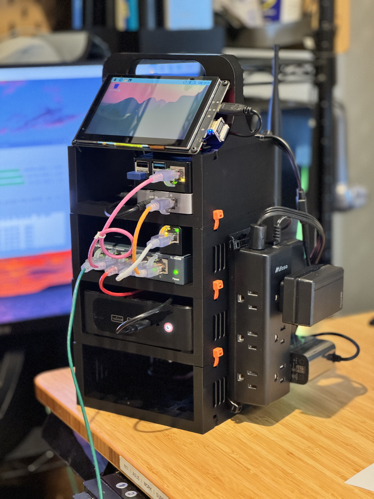

# MiniStackableRack



## 1. Overview

### 1.1 What Does It Do?

Provides an easy to make, deploy and remotely manage Home Automation/Monitoring/Server flexible solution.

**Easy to make:**
- 3D Printable in Bambu Lab's A1 Mini (18x18x18 cm print-bed area)
- Racks stack up with zip ties. Stack as many as you need. Quick, robust, virtually no assembly.
- Readily available components.

**Easy to deploy:**
- Prepare locally and ship to deploy. Requires 1 Cable for Power (110V/220V), 1 Cable for Data (ETH RJ45 or none with Wi-Fi fallback). Once connected, all can be done remotely.

**Easy to remotely manage:**
- Remote KVM enables complete remote management of MiniPC (inc. OS imaging).
- Tailscale provides straight forward individual remote access to each component without any port-forwarding / complex network setup.

**Flexible:**
- Proxmox will enable you to deploy anything.
- Scalable, stack as many racks as necessary.

---

### 1.2 Why Is It Useful?

Deploy at a relative's home, 2nd house, and you have yourself:
- A VPN at another country
- A redundant backup location, or upload a new movie for your family on the remote Plex server running on Proxmox
- An ability to see all devices in each deployed network with Tailscale Subnets (e.g.: print something for your dad at his place)
- An ability to deploy, maintain and integrate multiple Home Assistant instances into one overview/dashboard — sensors, cameras, power monitoring, etc.
- An ability to monitor all network traffic at each deployed site — the Raspberry Pi can ARP spoof the local network to route and inspect traffic per device, giving you visibility into what every device on the remote network is transmitting

**Smaller form factor:** As wide and deep as the largest component, the MiniPC/NUC.

---

### 1.3 Who Maintains

- Eduardo Cenci — [eduardocenci.com](http://eduardocenci.com) / [youtube.com/boredengineer](http://youtube.com/boredengineer)

---

## 2. Repository

### 2.1 .gitignore

- Credentials (omit `.env`)
- All content under folder `gitignore/`

### 2.2 Git Folder Structure

```
Root
├── gitignore/
├── 3d-models/
├── netoverview/    (submodule — github.com/eduardocenci/netoverview)
└── scripts/
```

### 2.3 Submodules

| Submodule | Path | Repository | Visibility |
|---|---|---|---|
| Network Overview | `netoverview/` | https://github.com/eduardocenci/netoverview | public |
| GlobalNet Dashboard | `globalnet/` | https://github.com/eduardocenci/globalnet | private |

Clone with submodules:
```bash
git clone --recurse-submodules <repo-url>
# or, after a plain clone:
git submodule update --init --recursive
```

---

## 3. Reference

### 3.1 Access / Links

Credentials are stored locally in `.env` (gitignored). All devices are Tailscale nodes.

| Deployment | Device | Access | Notes |
|---|---|---|---|
| Bnu | bnu-proxmox | https://bnu-proxmox:8006/ | |
| Bnu | bnu-homeassistant | http://bnu-homeassistant:8123/ | VM on bnu-proxmox |
| Bnu | bnu-win11 | RDP or SSH | VM on bnu-proxmox |
| Bnu | bnu-glkvm | https://bnu-glkvm/ | |
| Bnu | bnu-raspberrypi | RealVNC or SSH | |
| Ply | ply-proxmox | https://ply-proxmox:8006/ | Subnet router for 192.168.0.0/24 |
| Ply | ply-homeassistant | http://ply-homeassistant:8123/ | VM on ply-proxmox |
| Ply | ply-win11 | RDP or SSH | VM on ply-proxmox |
| Ply | ply-glkvm | https://ply-glkvm/ | |
| Ply | ply-raspberrypi | RealVNC or SSH | |
| Bg | bg-proxmox | https://bg-proxmox:8006/ | |
| Bg | bg-homeassistant | http://bg-homeassistant:8123/ | VM on bg-proxmox |
| Bg | bg-win11 | RDP or SSH | VM on bg-proxmox |
| Bg | bg-glkvm | https://bg-glkvm/ | |
| Bg | bg-raspberrypi | RealVNC or SSH | |

---

### 3.2 Topology

**Home Automation/Monitoring/Server MiniStackableRack** — Easy to deploy and remotely manage multiple instances.

- **Input:** One Cable for 110V / 220V Power, One Cable for 1GB Ethernet
- **MiniPC** running Proxmox (Tailscale Node; subnet router)
  - Home Assistant OS VM (Tailscale Node via add-on)
  - Additional VMs / containers as needed
- **Remote KVM** (Tailscale Node) — connected to MiniPC, enables remote desktop control from BIOS onwards; allows OS imaging via virtual CD-Rom
- **Raspberry Pi** (Tailscale Node) with Monitor
  - Status dashboard UI
  - Network overview dashboard — [netoverview](https://github.com/eduardocenci/netoverview) runs as a Docker container on each Raspberry Pi, auto-discovering all LAN devices via ping/ARP/port scan; accessible at `http://<deployment>-raspberrypi:5000`
  - Advanced network monitoring — the Pi can act as a passive traffic monitor by ARP spoofing the local network, routing all device traffic through itself to inspect what each device is transmitting
  - Wi-Fi to RJ45 bridge fallback (if no Ethernet at deployment site)
- **Zigbee 3.0 Gateway**

**Remote access summary:**
- Proxmox web UI → via Tailscale to `<deployment>-proxmox:8006`
- Home Assistant web UI → via Tailscale to `<deployment>-homeassistant:8123`
- KVM → via Tailscale to `<deployment>-glkvm`
- Raspberry Pi → RealVNC or SSH via Tailscale

---

### 3.3 Hardware

| HW Short | HW Detailed | Cost (Nov 2025) | Purchase Link |
|---|---|---|---|
| MiniPC | Beelink SER5 MAX — AMD Ryzen7 6800U (8C/16T, up to 4.7GHz), 32GB LPDDR5, 500GB M.2 SSD, Wifi6, 2.5G LAN | $349.00 | [Amazon](https://www.amazon.com/dp/B0DM5S3DWH) |
| Remote KVM | GL.iNet Comet (GL-RM1) — 4K@30Hz, Tailscale, Remote KVM, virtual CD-Rom | $89.99 | [Amazon](https://www.amazon.com/dp/B0F21SQ4S8) |
| Raspberry Pi | CanaKit Raspberry Pi 4 4GB Starter PRO Kit | $119.99 | [Amazon](https://www.amazon.com/dp/B07V5JTMV9) |
| Monitor | ELECROW 5 Inch Mini Touchscreen, 800×480, Raspberry Pi compatible | $36.09 | [Amazon](https://www.amazon.com/dp/B0CYKXCM8J) |
| Zigbee 3.0 Gateway | SMLIGHT SLZB-06 — Zigbee 3.0 to Ethernet/USB/WiFi, PoE, Zigbee2MQTT / ZHA | $74.99 | [Amazon](https://www.amazon.com/dp/B0BL6DQSB3) |
| 5 Port Switch | TP-Link TL-SG105, 5 Port Gigabit Unmanaged, Fanless | $15.99 | [Amazon](https://www.amazon.com/dp/B00A128S24) |
| Power Strip | 9-Outlet Surge Protector, Wall Mount, Flat Plug (5FT) | $9.99 | [Amazon](https://www.amazon.com/dp/B0BTP9K7WD) |
| MiniStackableRack | `MiniStackableRack_V3.stl/.3mf`, `MiniStackableRack_V3-Top_V3.stl/.3mf` | — | — |

---

## 4. Bring-up

> Follow the order below for a clean first-time setup.

---

### 4.1 Remote KVM (GL.iNet Comet GL-RM1)

#### 4.1.1 Connect to Power and Network

Connect the KVM to power and Ethernet. MiniPC does not need to be connected yet.

#### 4.1.2 Initial Web Access

Navigate to: `https://glkvm.lan` (or find the IP via your router's DHCP table).

#### 4.1.3 Set User / Password

Configure credentials via the KVM web UI. Store in `.env`. If a credential exists from other devices of same type, it must be kept the same.

#### 4.1.4 Test SSH Access

SSH is enabled by default. Verify it works before proceeding — prefer SSH and `curl` API calls over the browser UI for all subsequent operations (critical for LLM-assisted deployments).

```bash
ssh root@<deployment>-glkvm  # e.g. bnu-glkvm
```

For scripted/non-interactive SSH (used by LLM-assisted workflows), install `sshpass`:

```bash
winget install -e --id xhcoding.sshpass-win32 --accept-source-agreements --accept-package-agreements
```

Then use:

```bash
sshpass -p '<password>' ssh root@<deployment>-glkvm <command>
# or via env var:
SSHPASS='<password>' sshpass -e ssh root@<deployment>-glkvm <command>
```

> **Note (Git Bash / Windows):** `sshpass` may fail with `can't open /dev/tty` in Git Bash. If so, use interactive `ssh` or run from WSL.

**`ply` findings (2026-03-29):** Host key accepted; SSH reachable. Password auth blocked by Git Bash `/dev/tty` limitation — use interactive `ssh root@ply-glkvm` from terminal.

#### 4.1.5 Update Firmware

Update firmware through **Apps Center → Firmware** in the UI.

#### 4.1.6 Setup Tailscale

1. Go to **Apps Center** in the UI.
2. Activate the Tailscale toggle.
3. Bind your Tailscale account.
4. Verify the device appears in your Tailscale admin dashboard.

#### 4.1.7 Mount Proxmox Installation ISO

1. In the UI, go to **Virtual Media**.
2. Click **Url** under the upload area → paste the ISO URL → **Confirm**.
   - Latest ISO (as of 2026-03-28): `http://download.proxmox.com/iso/proxmox-ve_9.1-1.iso` (1.71 GB)
   - Latest releases: https://www.proxmox.com/en/downloads/proxmox-virtual-environment/iso
   - The KVM downloads directly to its onboard storage (~17 MB/s).
3. Once uploaded, click **Mount To Remote → Image Mounting**.
4. In Mount Settings: **Mount As = CD-Rom**, select the ISO, click **Mount Image**.
5. Verify: Windows on the MiniPC shows AutoPlay — **"CD Drive (D:) PVE"**.

> The ISO persists on the KVM's onboard storage between sessions. Eject via **Stop Mounting** when done.

---

### 4.2 MiniPC (Beelink SER5 MAX)

#### 4.2.1 Configure BIOS — Always ON After Power Loss

**Entering BIOS via KVM (Beelink SER5 MAX):**

The most reliable method is via Windows Recovery, not timing F7 at POST:

1. In the KVM Toolbox → Clipboard, set textarea value via browser console and click **Paste To Remote Device**:
   ```js
   let ta = document.querySelector('textarea');
   ta.value = 'Start-Process "ms-settings:recovery"\n';
   ta.dispatchEvent(new Event('input', {bubbles:true}));
   ```
2. In Windows: **Settings → System → Recovery → Advanced startup → Restart now → Troubleshoot → Advanced options → UEFI Firmware Settings → Restart**.

> `shutdown /r /fw /t 0` is not supported on this hardware (error 203).

**BIOS path:**
```
Advanced → AMD CBS → FCH Common Options → Ac Power Loss Options → Ac Loss Control → [Always On]
```

**`ply` findings (2026-03-28):** Unit shipped with Always On already set. No change needed.

---

#### 4.2.2 Retrieve Windows License Key

Run in PowerShell before wiping Windows:

```powershell
(Get-ItemProperty 'HKLM:\SOFTWARE\Microsoft\Windows NT\CurrentVersion\SoftwareProtectionPlatform').BackupProductKeyDefault
slmgr /dli
```

Save the key to `.env`.

---

#### 4.2.3 Install Proxmox VE

##### 4.2.3.1 Prerequisites

- BIOS boot order set to CD-Rom first (or use Advanced Startup → Use a device).
- Proxmox ISO mounted via KVM (see 4.1.6).

##### 4.2.3.2 Installation Steps

1. Boot via **Windows Advanced Startup → Use a device → UEFI: Glinet Optical Drive 1.00**.
2. At Proxmox boot menu → **Enter** → **Install Proxmox VE (Graphical)**.
3. Accept EULA.
4. Target disk: 500 GB M.2 SSD.
5. Location / timezone: set as appropriate.
6. Root password: set and save to `.env`.
7. Network hostname: `<deployment>-proxmox` (e.g. `ply-proxmox`).
8. Complete install; machine reboots into Proxmox VE.
9. Verify: **https://\<deployment\>-proxmox:8006/**

##### 4.2.3.3 Install Tailscale on Proxmox Host

Tailscale runs on the Proxmox host itself, making the hypervisor directly reachable on the Tailscale network and enabling subnet routing for all VMs.

1. Disable enterprise repos (require paid subscription):
   ```bash
   mv /etc/apt/sources.list.d/pve-enterprise.sources /etc/apt/sources.list.d/pve-enterprise.sources.disabled
   mv /etc/apt/sources.list.d/ceph.sources /etc/apt/sources.list.d/ceph.sources.disabled
   ```

2. Add no-subscription repo and install Tailscale:
   ```bash
   echo "deb http://download.proxmox.com/debian/pve trixie pve-no-subscription" \
     > /etc/apt/sources.list.d/pve-no-subscription.list
   apt-get update && apt-get install -y tailscale
   ```

3. Start and authenticate:
   ```bash
   systemctl enable --now tailscaled
   tailscale up
   ```
   Visit the printed URL in your browser and authenticate.

4. Enable subnet routing (to expose the local LAN via Tailscale):
   ```bash
   echo 'net.ipv4.ip_forward = 1' >> /etc/sysctl.d/99-tailscale.conf
   sysctl -p /etc/sysctl.d/99-tailscale.conf
   tailscale up --advertise-routes=192.168.0.0/24 --accept-routes
   ```

5. In Tailscale admin console → Machines → `<deployment>-proxmox` → **Edit route settings** → approve `192.168.0.0/24`.

**`ply` findings (2026-03-29):** Tailscale 1.96.4 installed; subnet routing active for `192.168.0.0/24`.

---

#### 4.2.4 Install Home Assistant OS VM

##### 4.2.4.1 Run Proxmox Helper Script

From the Proxmox shell:

```bash
bash -c "$(curl -fsSL https://raw.githubusercontent.com/community-scripts/ProxmoxVE/main/vm/haos-vm.sh)"
```

Accept defaults (VM ID 100, 2 cores, 4 GB RAM, 32 GB disk). The script downloads the HAOS image and starts the VM automatically.

Rename VM after creation:

```bash
qm set 100 --name <deployment>-homeassistant  # e.g. ply-homeassistant
```

Reference: [community-scripts/ProxmoxVE HAOS script](https://community-scripts.github.io/ProxmoxVE/scripts?id=haos-vm)

##### 4.2.4.2 Initial Onboarding

First user can be created via the HA API from the Proxmox shell (avoids needing local browser access):

```bash
HA_IP="<deployment>-homeassistant"  # e.g. ply-homeassistant
curl -s -X POST http://${HA_IP}:8123/api/onboarding/users \
  -H "Content-Type: application/json" \
  -d "{\"client_id\":\"http://${HA_IP}:8123/\",\"name\":\"Your Name\",\"username\":\"yourusername\",\"password\":\"$(grep HA_PASSWORD .env | cut -d= -f2)\"}"
```

Remaining onboarding steps (location, analytics, integrations) are completed via browser at `http://<deployment>-homeassistant:8123`.

##### 4.2.4.3 Set Static IP on Home Assistant

In HA: **Settings → System → Network** — assign a static IP to avoid DHCP changes.

##### 4.2.4.4 Install Tailscale App

1. **Settings → Apps → Install app** → search **Tailscale** → Install.
2. Start the app; go to Log (top menu); look for the link to authenticate, copy-paste into a browser window.
3. Verify `<deployment>-homeassistant` appears in Tailscale admin dashboard.

##### 4.2.4.5 Install Advanced SSH & Web Terminal

1. **Settings → Apps → Install app** → search **Advanced SSH & Web Terminal** → Install.
2. In the add-on configuration, set a password or disable password auth (use authorized keys).
3. Enable **Show in sidebar** if desired, then **Start** the add-on.

##### 4.2.4.6 Create Long-Lived Access Token

1. Go to **`http://<deployment>-homeassistant:8123/profile/security`**
2. Scroll to **Long-lived access tokens** → **Create token** → name it (e.g. `Claude`).
3. Copy the token and save it to `.env` as `<REGION>_HA_TOKEN=...` — it is only shown once.

##### 4.2.4.7 Install File Editor

1. **Settings → Apps → Install app** → search **File Editor** → Install.
2. Enable **Show in sidebar**, then **Start** the add-on.

##### 4.2.4.8 Install HACS (Home Assistant Community Store)

1. From the **Advanced SSH & Web Terminal** (or Proxmox shell via `ha` CLI), run the HACS install script:
   ```bash
   wget -O - https://get.hacs.xyz | bash -
   ```
2. Restart Home Assistant: **Settings → System → Restart**.
3. **Settings → Devices & Services → Add Integration** → search **HACS** → follow the GitHub authentication flow.

Reference: [HACS Installation](https://hacs.xyz/docs/use/download/download/)

---

#### 4.2.5 Install Windows 11 VM (Optional)

> Reference: https://www.youtube.com/watch?v=9FCDIavw3EM
Download Windows 11: https://www.microsoft.com/en-gb/software-download/windows11
VirtIO Drivers: https://pve.proxmox.com/wiki/Windows_VirtIO_Drivers

---

### 4.3 Raspberry Pi

#### 4.3.1 Flash OS

1. Download [Raspberry Pi Imager](https://www.raspberrypi.com/software/).
2. Select OS: **Raspberry Pi OS (64-bit)**.
3. Flash to SD card and boot.

#### 4.3.2 Setup Tailscale

```bash
curl -fsSL https://tailscale.com/install.sh | sh
tailscale up
```

To broadcast subnets: https://tailscale.com/kb/1019/subnets

#### 4.3.3 Install Docker

```bash
curl -fsSL https://get.docker.com | sh
sudo usermod -aG docker $USER
newgrp docker
```

#### 4.3.4 Deploy Network Overview (netoverview)

`netoverview` is a self-hosted LAN monitoring dashboard included as a Git submodule. It runs as a Docker container on each Raspberry Pi, auto-discovering devices on the local network via ping, ARP, reverse DNS, and port scanning. Accessible at `http://<deployment>-raspberrypi:5000`.

**First-time setup on a new Pi:**

1. Copy the compose file and start the container:
   ```bash
   mkdir ~/netoverview
   cp netoverview/netoverview_docker/docker-compose.yml ~/netoverview/
   cd ~/netoverview
   docker compose up -d
   ```

2. Install the auto-update cron job (runs every 5 min, pulls new image if available):
   ```bash
   (crontab -l 2>/dev/null; echo "*/5 * * * * cd ~/netoverview && docker compose pull -q && docker compose up -d") | crontab -
   ```

3. Verify at `http://<deployment>-raspberrypi:5000` — the first background scan starts automatically within a few seconds.

**Updating (ongoing):** `git push` to `netoverview/` is the only step. GitHub Actions builds the new image; the Pi's cron job picks it up within ≤5 minutes automatically. No SSH or manual intervention needed.

> Uses host networking so the container can see all devices on the LAN. Data (nicknames, scan history) persists in a named Docker volume (`netoverview_data`) and survives image updates.

---

#### 4.3.5 Wi-Fi to RJ45 Bridge (Optional)

If the Pi must share Wi-Fi over Ethernet to other rack devices:
https://raspberrypi.stackexchange.com/questions/48307/sharing-the-pis-wifi-connection-through-the-ethernet-port

---

### 4.4 Monitor

Turn the switch **On** on the PCB.

---

### 4.5 Zigbee 3.0 Gateway

> TBD — connect via PoE to the switch; configure in Home Assistant via Zigbee2MQTT or ZHA.

---

### 4.6 MiniStackableRack (Physical Assembly)

> TBD — stack racks using zip ties through the corner holes. No tools required.

---

## 5. Deployment (On-Site)

> TBD

---

## 6. KVM Usage Notes

### Sending Commands via KVM Clipboard

The KVM (GL.iNet Comet) Toolbox clipboard sends keystrokes character by character over USB HID. Use the browser console to inject text and then click **Paste To Remote Device**:

```js
let ta = document.querySelector('textarea');
ta.value = 'your-command-here\n';
ta.dispatchEvent(new Event('input', {bubbles:true}));
```

To send just Enter (e.g. to confirm a dialog):
```js
let ta = document.querySelector('textarea');
ta.value = '\n';
ta.dispatchEvent(new Event('input', {bubbles:true}));
```

### Known Quirks

- `shutdown /r /fw /t 0` fails on Beelink SER5 MAX (error 203) — use Windows Settings → Recovery instead.
- KVM clipboard paste is the most reliable input method; direct key injection via WebRTC is inconsistent.
- Proxmox helper script dialogs respond to Enter key via clipboard `\n` paste.
